# Linux Server Administration Home Lab

## Project Overview

This project simulates a small business Linux server environment using Ubuntu Server 24.04 LTS in VirtualBox. The goal was to build a practical junior systems administrator lab that demonstrates Linux server installation, network configuration, SSH administration, firewall configuration, user and group management, shared folder permissions, access control testing, log review, service management, and basic backup automation.

This project was built to complement a Windows Server Active Directory home lab and demonstrate foundational administration skills across both Windows and Linux environments.

## Project Screenshots

### Ubuntu Server System Information

This screenshot shows the Ubuntu Server system information, including the hostname, operating system version, kernel version, architecture, and VirtualBox virtualization platform.

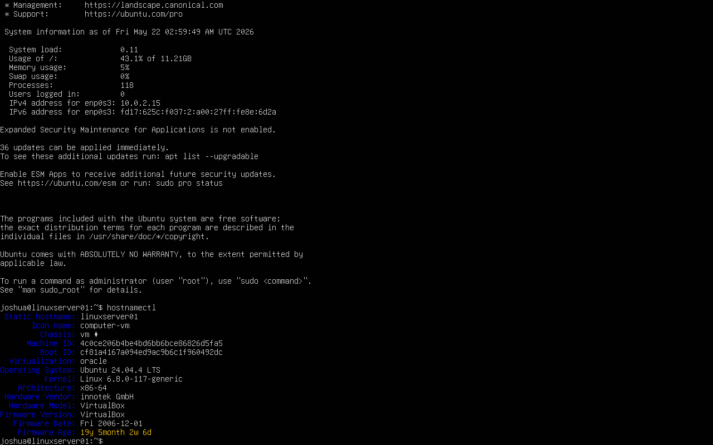

---

### Network Configuration

This screenshot shows the server network configuration using `ip addr`, including the NAT adapter for internet access and the host-only lab adapter used for the internal VirtualBox network.

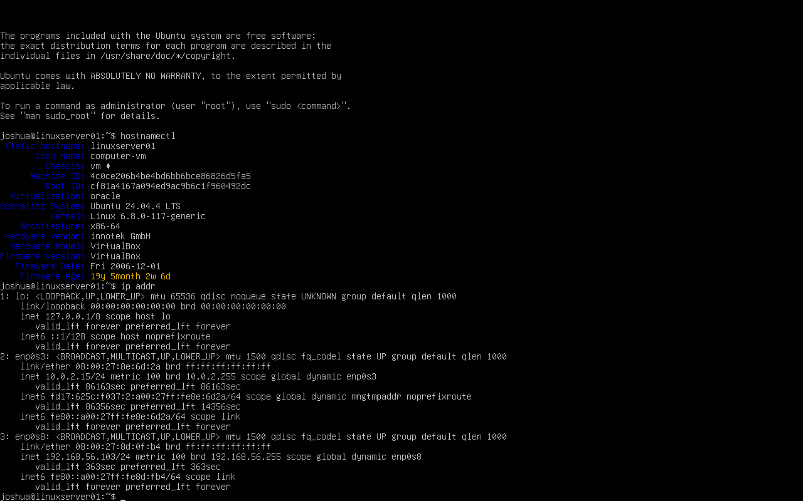

---

### SSH Service Status

This screenshot shows the OpenSSH service enabled and running on the Linux server.

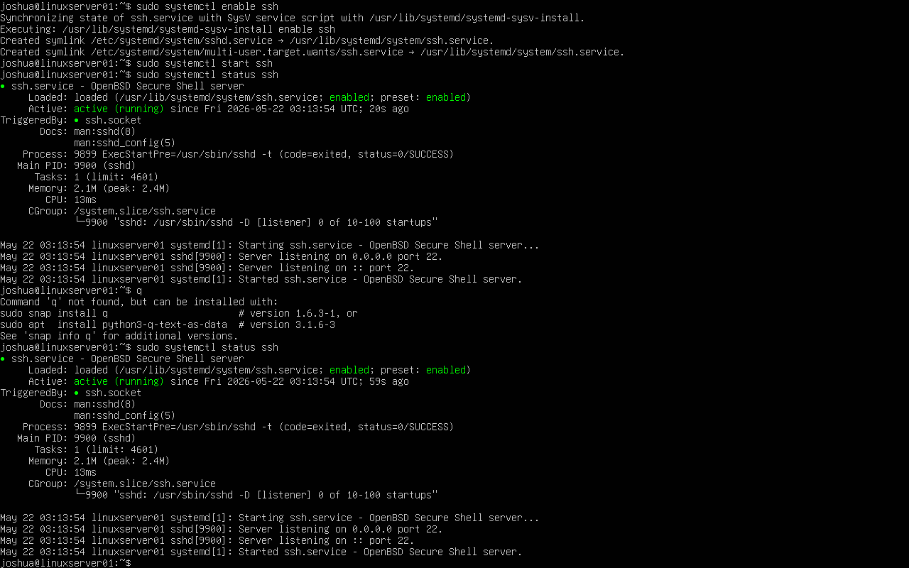

---

### UFW Firewall Configuration

This screenshot shows the UFW firewall enabled with OpenSSH allowed through the firewall.

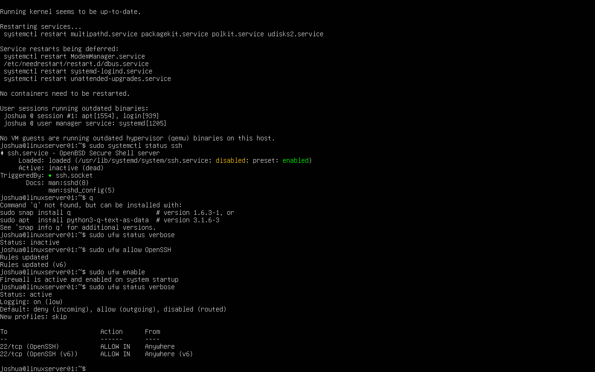

---

### Linux Users and Groups

This screenshot shows Linux users assigned to department-based groups such as `it_admins`, `accounting`, `operations`, and `hr`.

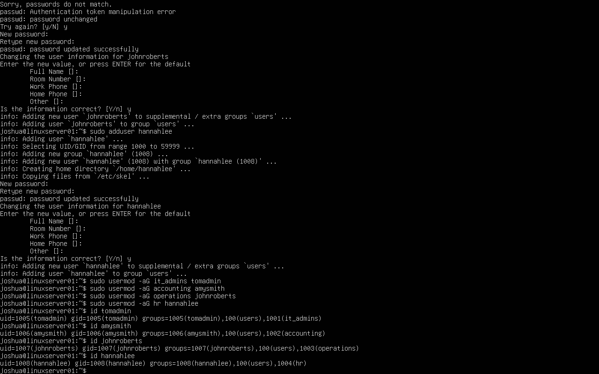

---

### CompanyShares Folder Permissions

This screenshot shows the shared folder structure under `/srv/companyshares` with Linux ownership and permissions configured for department groups.

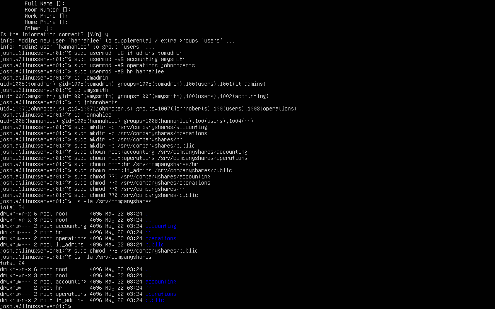

---

### Permission Test

This screenshot shows an HR user successfully creating a file in the HR folder while being denied access to the Operations folder.

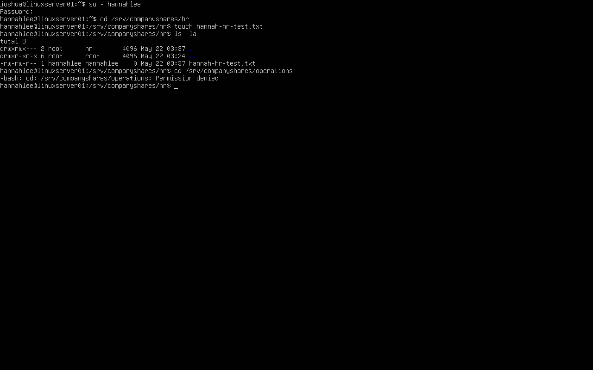

---

### Backup Script

This screenshot shows the Bash backup script used to archive the `/srv/companyshares` directory.

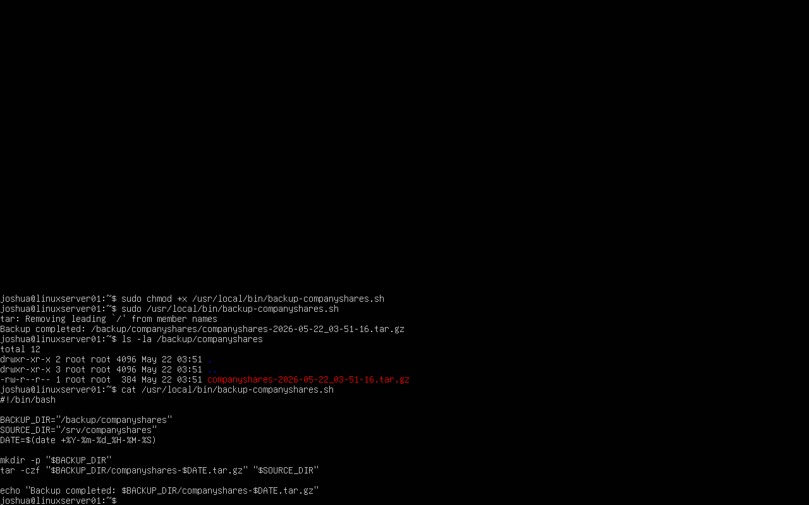

---

### Backup Script Output

This screenshot shows the backup script running successfully and creating a compressed `.tar.gz` backup archive.

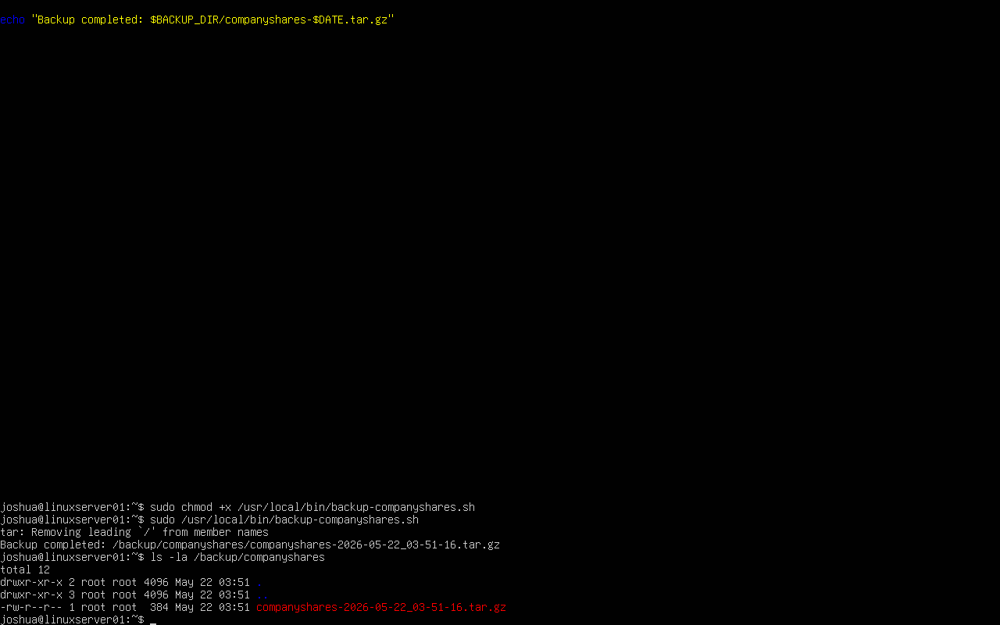

---

### SSH Logs

This screenshot shows SSH service logs reviewed with `journalctl`.

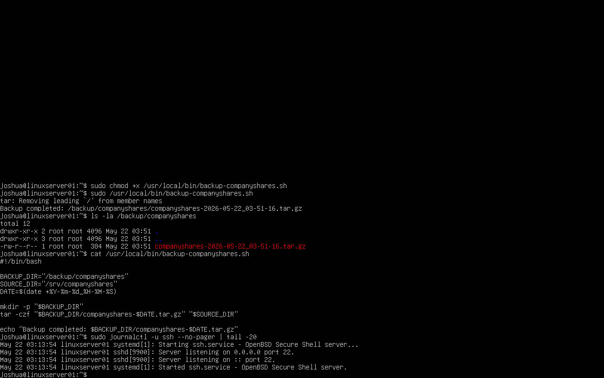

---

### Login History

This screenshot shows login and reboot history using the `last` command.

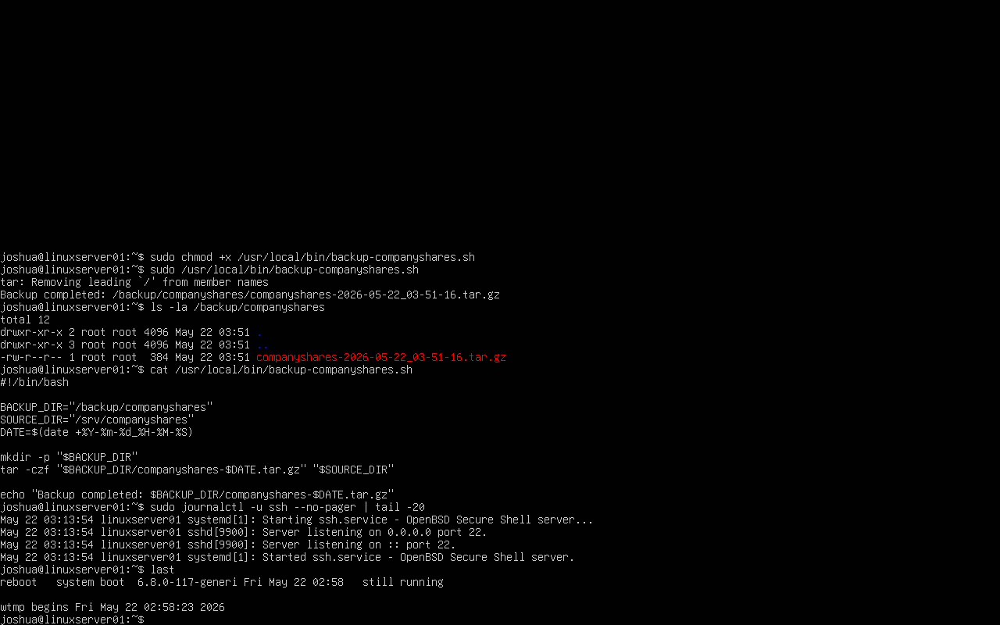

---

### Running Services

This screenshot shows active Linux services using `systemctl`.

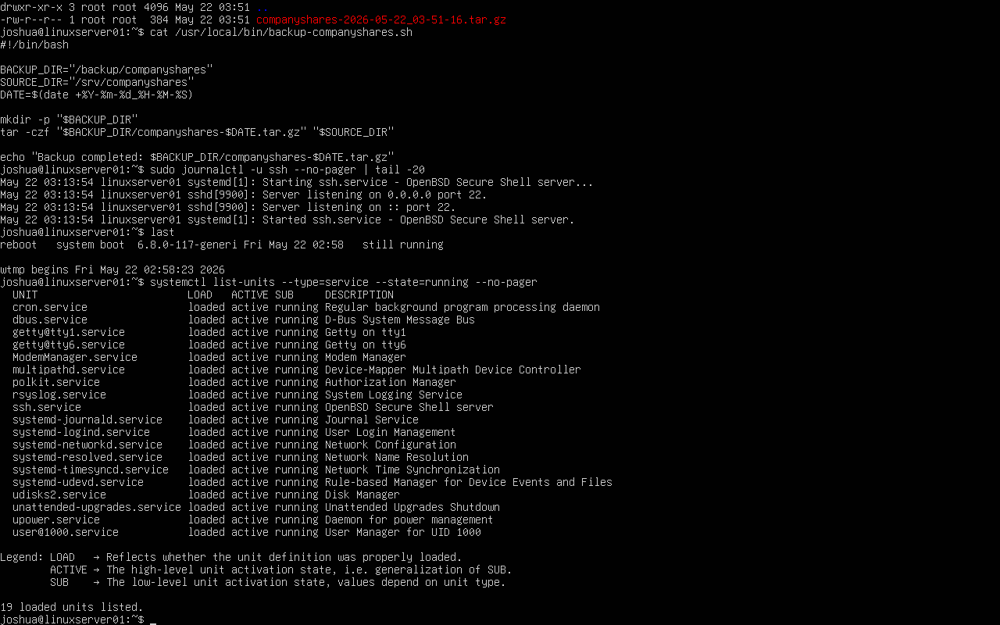

## Lab Environment

| System | Role | Operating System |
|---|---|---|
| linuxserver01 | Linux server, SSH server, file permissions lab, backup automation | Ubuntu Server 24.04 LTS |
| Host Machine | VirtualBox host | Windows |

## Network Configuration

| Adapter | Purpose | IP Address |
|---|---|---|
| NAT Adapter | Internet access for package updates | 10.0.2.15 |
| Host-only Adapter | Internal VirtualBox lab network | 192.168.56.103 |

The NAT adapter provided internet access for updates and package management. The host-only adapter provided an isolated lab network for local administration and testing.

## Objectives

- Install and configure Ubuntu Server 24.04 LTS in VirtualBox.
- Verify system information using `hostnamectl`.
- Review network configuration using `ip addr`.
- Install, enable, and verify OpenSSH service.
- Configure UFW firewall rules to allow SSH.
- Create Linux users and department-based groups.
- Configure shared folders under `/srv/companyshares`.
- Apply Linux ownership and permissions using `chown` and `chmod`.
- Test user access to validate permissions.
- Create a Bash backup script for shared folders.
- Review SSH logs and login history.
- List active services using `systemctl`.

## Users and Groups

Department-based groups were created to simulate business access control.

| Group | Purpose |
|---|---|
| it_admins | Linux administrative group for IT users |
| accounting | Accounting department file access |
| operations | Operations department file access |
| hr | HR department file access |

Example users created:

| User | Username | Group |
|---|---|---|
| Tom Admin | tomadmin | it_admins |
| Amy Smith | amysmith | accounting |
| John Roberts | johnroberts | operations |
| Hannah Lee | hannahlee | hr |

## Shared Folder Structure

A shared folder structure was created under `/srv/companyshares`.

```text
/srv/companyshares
├── accounting
├── operations
├── hr
└── public
```

## Folder Ownership and Permissions

Permissions were assigned using Linux groups instead of individual users.

| Folder | Owner | Group | Permission |
|---|---|---|---|
| /srv/companyshares/accounting | root | accounting | 770 |
| /srv/companyshares/operations | root | operations | 770 |
| /srv/companyshares/hr | root | hr | 770 |
| /srv/companyshares/public | root | it_admins | 775 |

The department folders were configured so only the correct Linux group could access each folder. This is similar to using security groups for NTFS permissions in a Windows Server environment.

## Commands Used

### System Information

```bash
hostnamectl
ip addr
```

### SSH Service

```bash
sudo systemctl enable ssh
sudo systemctl start ssh
sudo systemctl status ssh
```

### Firewall

```bash
sudo ufw allow OpenSSH
sudo ufw enable
sudo ufw status verbose
```

### Groups

```bash
sudo groupadd it_admins
sudo groupadd accounting
sudo groupadd operations
sudo groupadd hr
```

### Users

```bash
sudo adduser tomadmin
sudo adduser amysmith
sudo adduser johnroberts
sudo adduser hannahlee
```

### Add Users to Groups

```bash
sudo usermod -aG it_admins tomadmin
sudo usermod -aG accounting amysmith
sudo usermod -aG operations johnroberts
sudo usermod -aG hr hannahlee
```

### Verify Group Membership

```bash
id tomadmin
id amysmith
id johnroberts
id hannahlee
```

### Create Shared Folders

```bash
sudo mkdir -p /srv/companyshares/accounting
sudo mkdir -p /srv/companyshares/operations
sudo mkdir -p /srv/companyshares/hr
sudo mkdir -p /srv/companyshares/public
```

### Set Ownership

```bash
sudo chown root:accounting /srv/companyshares/accounting
sudo chown root:operations /srv/companyshares/operations
sudo chown root:hr /srv/companyshares/hr
sudo chown root:it_admins /srv/companyshares/public
```

### Set Permissions

```bash
sudo chmod 770 /srv/companyshares/accounting
sudo chmod 770 /srv/companyshares/operations
sudo chmod 770 /srv/companyshares/hr
sudo chmod 775 /srv/companyshares/public
```

### Verify Folder Permissions

```bash
ls -la /srv/companyshares
```

## Permission Testing

User access was tested by switching to department users and attempting to access authorized and unauthorized folders.

Example:

```bash
su - hannahlee
cd /srv/companyshares/hr
touch hannah-hr-test.txt
cd /srv/companyshares/operations
```

Expected result:

| User | Allowed Access | Blocked Access | Result |
|---|---|---|---|
| hannahlee | /srv/companyshares/hr | /srv/companyshares/operations | Successful |
| johnroberts | /srv/companyshares/operations | /srv/companyshares/accounting | Successful |
| amysmith | /srv/companyshares/accounting | /srv/companyshares/operations | Successful |

The access control test confirmed that department users could access their assigned folders and were denied access to unauthorized department folders.

## Backup Automation

A Bash script was created to back up the `/srv/companyshares` directory into a compressed archive.

Script location:

```text
/usr/local/bin/backup-companyshares.sh
```

Backup destination:

```text
/backup/companyshares
```

Script:

```bash
#!/bin/bash

BACKUP_DIR="/backup/companyshares"
SOURCE_DIR="/srv/companyshares"
DATE=$(date +%Y-%m-%d_%H-%M-%S)

mkdir -p "$BACKUP_DIR"
tar -czf "$BACKUP_DIR/companyshares-$DATE.tar.gz" "$SOURCE_DIR"

echo "Backup completed: $BACKUP_DIR/companyshares-$DATE.tar.gz"
```

The script was made executable and tested successfully.

```bash
sudo chmod +x /usr/local/bin/backup-companyshares.sh
sudo /usr/local/bin/backup-companyshares.sh
ls -la /backup/companyshares
```

## Log Review and Service Management

SSH logs were reviewed using:

```bash
sudo journalctl -u ssh --no-pager | tail -20
```

Login history was reviewed using:

```bash
last
```

Running services were reviewed using:

```bash
systemctl list-units --type=service --state=running --no-pager
```

These checks demonstrate basic Linux monitoring and troubleshooting skills.

## Skills Demonstrated

- Ubuntu Server installation
- Linux command-line administration
- VirtualBox networking
- NAT and host-only adapter configuration
- SSH service administration
- UFW firewall configuration
- Linux users and groups
- File and directory permissions
- Ownership management with `chown`
- Permission management with `chmod`
- Access control testing
- Bash scripting
- Backup automation
- Linux log review with `journalctl`
- Login history review with `last`
- Service management with `systemctl`
- Basic troubleshooting and verification

## Troubleshooting Notes

During the lab, several issues were identified and resolved:

- Verified the correct network adapters using `ip addr`.
- Confirmed NAT provided internet access and the host-only adapter provided an internal lab IP.
- Enabled and started the SSH service after confirming it was installed.
- Allowed OpenSSH through UFW before enabling the firewall.
- Corrected folder permissions to enforce department-based access control.
- Tested unauthorized folder access to confirm permissions were working.
- Verified backup creation by listing the contents of `/backup/companyshares`.

## Project Outcome

This lab successfully created a small business Linux server environment with SSH access, firewall protection, department-based users and groups, shared directory permissions, access control testing, log review, service monitoring, and backup automation. The project demonstrates practical junior Linux systems administration skills that apply to real business server environments.